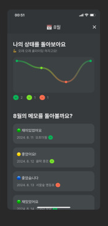

# 🧻 응어리 (Eungeori)

응어리는 사용자의 배변 활동을 기록하고, 건강한 습관을 유지할 수 있도록 도와주는 스마트한 애플리케이션입니다.

## 📱 주요 기능

### 1. 배변 활동 기록

- **시간 기록**: 배변 시간을 손쉽게 기록하고 관리할 수 있습니다.
- **상태 체크**: 배변 상태를 `묽음`, `딱딱함`, `정상`으로 구분하여 기록합니다.
- **메모 기능**: 배변과 관련된 메모를 남겨 건강 상태를 상세히 기록할 수 있습니다.

### 2. 배변 패턴 분석

- **패턴 시각화**: 주간 및 월간 단위로 배변 빈도를 시각적으로 확인할 수 있습니다. 이를 통해 개인의 배변 패턴을 파악하고, 건강 관리에 도움을 받을 수 있습니다.

## 🛠 기술 스택

### 주요 프레임워크 및 라이브러리

- **Next.js 14**: 서버 사이드 렌더링(SSR)과 정적 사이트 생성(SSG)을 지원하는 React 기반 프레임워크
- **TypeScript**: 정적 타입을 지원하는 JavaScript의 슈퍼셋으로, 안정성과 가독성을 향상
- **Vanilla Extract**: CSS의 타입 안전성을 제공하는 스타일링 라이브러리
- **Zustand**: 간단하고 직관적인 상태 관리 라이브러리
- **React Hook Form**: 폼 상태 관리 및 유효성 검사를 간소화하기 위한 라이브러리

### 데이터 처리 및 백엔드 연동

- **Supabase**:
  - **@supabase/supabase-js**: Supabase API와의 클라이언트 통신을 위한 라이브러리
  - **@supabase/ssr**: SSR 환경에서 Supabase를 활용하기 위한 도구
- **Immer**: 불변성 관리를 간소화하여 상태 업데이트 로직을 직관적으로 작성

### 패키지매니저

- **PNPM**: 빠르고 효율적인 패키지 매니저로, 중복된 패키지를 링크 방식으로 관리하여 설치 속도가 빠르고 디스크 사용량을 줄여줌

## 🚀 설치 및 실행

### 로컬 환경에서 실행하기

1. 레포지토리를 클론합니다:

   ```bash
   git clone https://github.com/yourusername/eungeori.git
   ```

2. 프로젝트 디렉토리로 이동합니다

   ```bash
   cd eungeori
   ```

3. 의존성을 설치합니다:

   ```bash
   pnpm install
   ```

4. 개발 서버를 시작합니다:

   ```bash
   pnpm run dev
   ```

5. 브라우저에서 `http://localhost:3000`을 열어 애플리케이션을 확인합니다.

## 📸 참고 자료

### 참고한 어플리케이션 스크린샷

아래는 참고한 어플리케이션의 스크린샷입니다.

오클고<br/>


인아웃<br/>


미라클나잇<br/>

